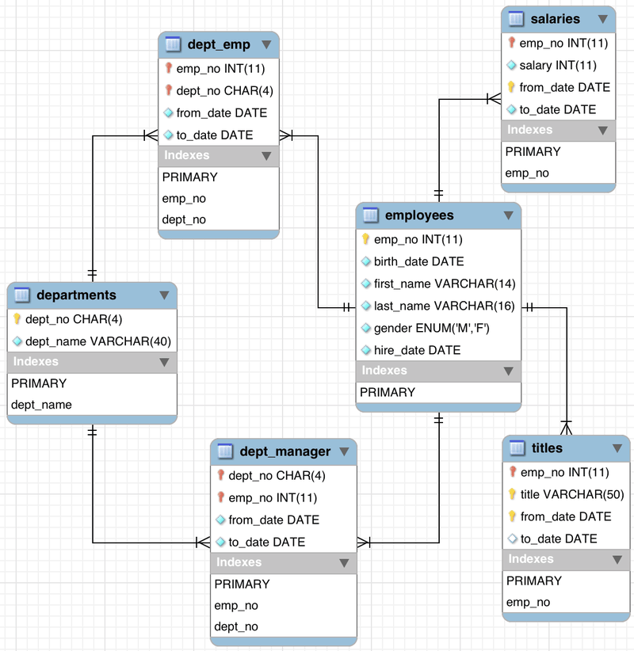

## Import bazy pracowników


0. Skopiuj cały folder `employees` do ścieżki `C:\DB`
1. Otwieramy konsolę wpisując w pasek start `cmd`
2. Przechodzimy do lokalizacji folderu employees poleceniem:
```
cd c:\DB\employees
```
3. Następnie wykonujemy import danych poprzez wpisanie:
```
mysql -u root -p < employees.sql
```
powinniśmy zostać zapytani o hasło do root, to hasło które ustaliliśmy podczas instalacji
Powinny pojawić się następujące logi:
```
C:\DB\test>mysql -u root -p < employees.sql
Enter password: *******
INFO
CREATING DATABASE STRUCTURE
INFO
storage engine: InnoDB
INFO
LOADING departments
INFO
LOADING employees
INFO
LOADING dept_emp
INFO
LOADING dept_manager
INFO
LOADING titles
INFO
LOADING salaries
data_load_time_diff
00:01:07
```
4. Weryfikujemy czy wszystko przebiegło poprawnie odpalająć skrypt walidacyjny:
```
mysql -u root -p -t < test_employees_md5.sql
```
powinniśmy otrzymać poniższe logi:
```
C:\DB\test>mysql -u root -p -t < test_employees_md5.sql
Enter password: *******
+----------------------+
| INFO                 |
+----------------------+
| TESTING INSTALLATION |
+----------------------+
+--------------+------------------+----------------------------------+
| table_name   | expected_records | expected_crc                     |
+--------------+------------------+----------------------------------+
| employees    |           300024 | 4ec56ab5ba37218d187cf6ab09ce1aa1 |
| departments  |                9 | d1af5e170d2d1591d776d5638d71fc5f |
| dept_manager |               24 | 8720e2f0853ac9096b689c14664f847e |
| dept_emp     |           331603 | ccf6fe516f990bdaa49713fc478701b7 |
| titles       |           443308 | bfa016c472df68e70a03facafa1bc0a8 |
| salaries     |          2844047 | fd220654e95aea1b169624ffe3fca934 |
+--------------+------------------+----------------------------------+
+--------------+------------------+----------------------------------+
| table_name   | found_records    | found_crc                        |
+--------------+------------------+----------------------------------+
| employees    |           300024 | 4ec56ab5ba37218d187cf6ab09ce1aa1 |
| departments  |                9 | d1af5e170d2d1591d776d5638d71fc5f |
| dept_manager |               24 | 8720e2f0853ac9096b689c14664f847e |
| dept_emp     |           331603 | ccf6fe516f990bdaa49713fc478701b7 |
| titles       |           443308 | bfa016c472df68e70a03facafa1bc0a8 |
| salaries     |          2844047 | fd220654e95aea1b169624ffe3fca934 |
+--------------+------------------+----------------------------------+
+--------------+---------------+-----------+
| table_name   | records_match | crc_match |
+--------------+---------------+-----------+
| employees    | OK            | ok        |
| departments  | OK            | ok        |
| dept_manager | OK            | ok        |
| dept_emp     | OK            | ok        |
| titles       | OK            | ok        |
| salaries     | OK            | ok        |
+--------------+---------------+-----------+
+------------------+
| computation_time |
+------------------+
| 00:00:17         |
+------------------+
+---------+--------+
| summary | result |
+---------+--------+
| CRC     | OK     |
| count   | OK     |
+---------+--------+
```

5. Pomyślnie zaimportowaliśmy bazę `Employees`. Poniżej diagram ERD schematu tej bazy.


Źródło: [https://github.com/datacharmer/test_db](https://github.com/datacharmer/test_db)
